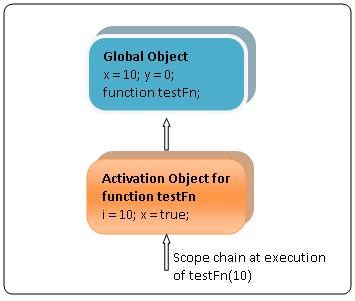
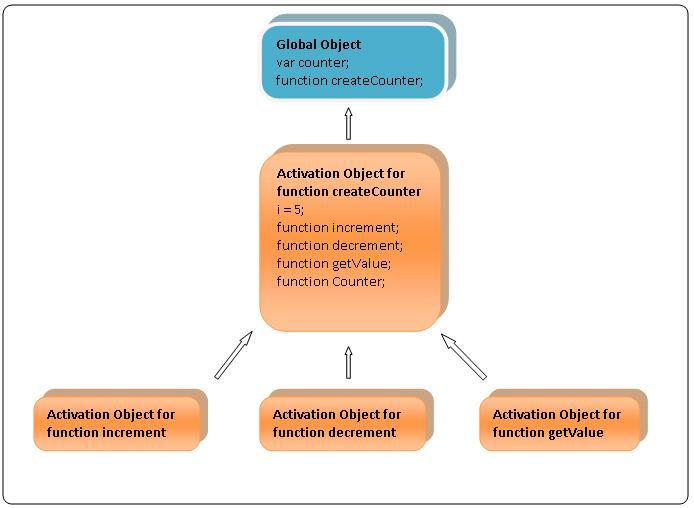

##理解scope chain

scope chain有点类似c/c++里面作用域的概念, 他本身是一些对象的链表, 当需要去查找变量的时候，就涉及到scope chain, 所有有效的变量都应该在scope chain里面可以找到.

具体说scope chain之前，需要了解几个概念.    

###Global Object  
当我们执行javascript的时候,javascript engine会创建一个全局对象(Global object), 对于一些预定义的对象,值都是作为全局对象的属性存在的,比如 ‘Infinity’, ‘Math’. 我们在代码里面定义的全局变量也是作为全局对象的属性存在的.
比如直接在全局的执行环境里面定义    
    
    var foo = 1;     
    foo1 = 2;  eval
    function bar(){}  
    
那么结果是    

    GLOBAL_OBJECT.foo; // 1    
    GLOBAL_OBJECT.foo1; // 2   
    foo === GLOBAL_OBJECT.foo; // true    
    foo1 === GLOBAL_OBJECT.foo1; // true    
    typeof GLOBAL_OBJECT.bar; // "function"    
    GLOBAL_OBJECT.bar === bar; // true

###Activation Object
当一个函数执行的时候,在进入这个函数的时候,javascript engine会创建一个新对象,我们暂且称之为Activation Object,所有函数内定义的变量,有名字的参数以及arguments本身,都是作为activation object的属性存在的.

    (function(foo){

	    var bar = 2;
	    function baz(){}
	
	    /*
	    In abstract terms,
	
	    Special `arguments` object becomes a property of containing function's Activation object:
	      ACTIVATION_OBJECT.arguments; // Arguments object
	
	    ...as well as argument `foo`:
	      ACTIVATION_OBJECT.foo; // 1
	
	    ...as well as variable `bar`:
	      ACTIVATION_OBJECT.bar; // 2
	
	    ...as well as function declared locally:
	      typeof ACTIVATION_OBJECT.baz; // "function"
	    */

      })(1);

通常,在函数执行的时候,这个Activation Object会被创建,在函数执行结束,这个Activation Object会被释放掉.但是在函数嵌套的情况下,外部函数的Activation Object会被保留下来.具体可看下面嵌套函数小节.

###关于eval函数   
需要注意的是eval函数定义的变量,如果eval是在某个函数里面执行的,那么eval里面定的变量就是属于这个函数的Activation Object;如果是在全局环境下执行的，那么eval里面定的变量就是属于这个函数的Global Object. 
   
	  var GLOBAL_OBJECT = this;

	  /* `foo` is created as a property of calling context Variable object,
	      which in this case is a Global object */
	
	  eval('var foo = 1;');
	  GLOBAL_OBJECT.foo; // 1
	
	  (function(){
	
	    /* `bar` is created as a property of calling context Variable object,
	      which in this case is an Activation object of containing function */
	
	    eval('var bar = 1;');
	
	    /*
	      In abstract terms,
	      ACTIVATION_OBJECT.bar; // 1
	    */
	
	  })();

###Scope Chain  
现在来讨论Scope Chain,先看一个简单的例子.     

	var x = 10;
	var y = 0;
	function testFn(i)
	{
	    var x = true;
	    y = y + 1;
	    console.log(i);
	}
	 
	testFn(10);

当执行testFn的时候,Scope Chain就是类似下图.
 
     
从图中,我们可以得知Scope Chain就是函数的Activation Object和Global Object组合起来的链表,Global Object永远是在最后面.    
在函数testFn里面,由于重新定义了变量x,这个x是testFn的Activation Object的一个属性,所有查找x的时候,先从当前Activation Object里面找,找到了停住搜索，没找到就继续沿着Scope Chain后找.按照这个逻辑,找y的时候就是从Global Object里面找,因为当前Activation Object没有这个属性.

###Nested functions
现在来看复杂一点的情况,就是函数嵌套.理解嵌套函数的scope chain也有助于我们理解闭包.    

	function outerFn(i,j)
	{
	    var x = i + j;
	    return function innerFn(x)
	    {
	        return i + x;
	    }
	}
	 
	var func1 = outerFn(5,6);
	var func2 = outerFn(10,20);
	 
	console.log(func1(10));//Returns 15
	console.log(func2(10));//Returns 20

执行func1和func2的时候,实际是在执行innerFn,这个时候有个疑问,在innerFn里面,i和x是在哪里定义的.     

首先说x,用上面scope chain的逻辑来解释, innerFn执行的时候会创建一个Activation Object,所有的有名字的参数都会存在于当前Activation Object的属性里面,当前innerFn的Activation Object肯定是scope chain的最顶端,所以结论是x是innerFn的Activation Object里面定义的x,而不是外面outerFn定义的x.    

再来看i,当前innerFn没有定义i,在outerFn的Activation Object存在属性i.javascript针对这种情况,会为innerFn保留外部函数(outerFn)执行时候**整个**的scope chain.
    
     
现在来看看func2和func1执行时候,变量i有什么不同,来验证我们上面的描述  
     

比较上面2张图,我们可以看出javascripte engine针对func1,func2各自都都保存了一份outerFn执行的scope chain.

###多个嵌套函数  
当一个函数里面有多个嵌套函数,比如下面的例子.
	function createCounter(i)
	{
	    function increment()
	    {   ++i;    }
	   
	    function decrement()
	    {   --i;    }
	   
	    function getValue()
	    {   return i;    }
	   
	    function Counter(increment,decrement,getValue)
	    {
	        this.increment = increment;
	        this.decrement = decrement;
	        this.getValue = getValue;
	    }
	   
	    return new Counter(increment,decrement,getValue);
	}
 
	var counter = createCounter(5);
	counter.increment();
	console.log(counter.getValue());//Returns 6    

这个时候javascripte engine只会为所有的内嵌函数保存一份外部函数的scope chain.所有内嵌函数的执行时的scope chain都会指向这份拷贝.如下图.    
      

参考文章

>[MSDN: Scope chain of JScript Functions](http://blogs.msdn.com/b/jscript/archive/2007/07/26/scope-chain-of-jscript-functions.aspx)    
>[kangax: understanding-delete](http://perfectionkills.com/understanding-delete/)   